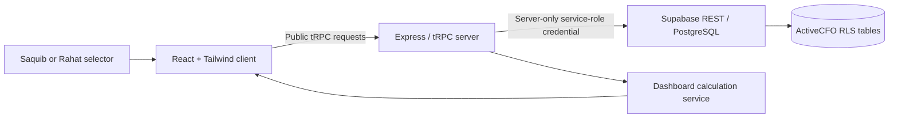

# ActiveCFO Architecture

## System Overview

ActiveCFO uses a React client, a public no-auth tRPC application server, and an existing Supabase PostgreSQL project. The two-profile selector is a product-level constraint enforced in the database and server input validation. It is not a security identity system.

## Runtime Components

| Layer | Location | Responsibility |
| --- | --- | --- |
| Client application | `client/src/pages/Home.tsx` | Renders all views, holds selected profile/month/UI state, submits form data, and displays success or failure feedback. |
| Client transport | `client/src/main.tsx` and `client/src/lib/trpc.ts` | Configures public tRPC transport without an OAuth redirect or browser credential. |
| API contract | `server/routers.ts` | Defines validated public procedures for dashboard reads and each CRUD entity. |
| Data service | `server/activecfo.ts` | Holds the server-only Supabase REST client, record helpers, and deterministic dashboard calculations. |
| Database schema | `database/20260813_activecfo_crud.sql` | Defines tables, constraints, timestamps, indexes, RLS, and the two permitted profile codes. |
| Tests | `server/activecfo.test.ts`, `server/supabase.config.test.ts` | Verify virtual-balance calculation, exact profiles, and server credential connectivity. |

## Data Model

| Table | Primary role | Key relationship |
| --- | --- | --- |
| `activecfo_profiles` | Fixed Saquib/Rahat selector | Parent record for profile-scoped data. |
| `activecfo_monthly_settings` | Opening balance and emergency target per month | Unique by profile and month. |
| `activecfo_thresholds` | Monthly category limits | Unique by profile, month, bucket, and category. |
| `activecfo_ledger_entries` | Income and expense journal | Drives balance and threshold usage. |
| `activecfo_investment_records` | Manual allocation records | Supports the five requested investment types. |
| `activecfo_insurance_records` | Term, Health, Corporate policies | Separate policy details and renewal fields. |
| `activecfo_guardrails` | Standing financial decision rules | Supports active and paused states. |
| `activecfo_strategies` | Repeatable review and action rules | Captures cadence and triggers. |
| `activecfo_signals` | Manual reminders | Complements computed threshold warnings. |
| `activecfo_help_articles` | Household-specific operating notes | Shared instructional content. |

## Security Boundary

The client never communicates with Supabase directly. Instead, it calls the application server, which attaches `SUPABASE_SERVICE_ROLE_KEY` on the server side. ActiveCFO tables have Row Level Security enabled with no anon/authenticated policies because no public browser access is intended. This design keeps the Supabase credential out of the frontend while retaining the requested no-login user experience.

## Documentation and Comment Locations

The source code includes explicit comments at the no-auth compatibility boundary and data-service boundary. Add or update comments when changing access behavior, calculations, service-role use, RLS posture, or irreversible migrations. Functional code paths should remain concise; design history belongs in the Markdown files.

