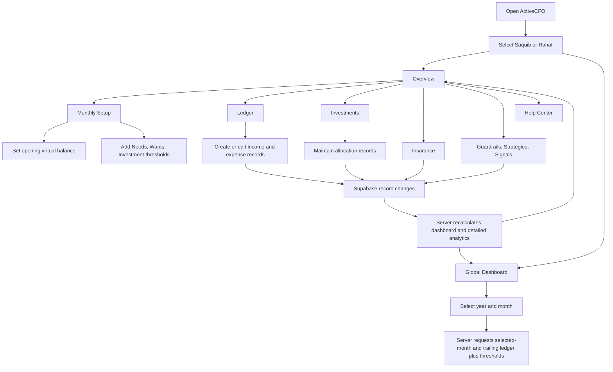

# ActiveCFO User and Data Flows

## Documentation Rule

`FLOW.md` is the **canonical, uppercase** flow record. It is maintained alongside `DECISIONS.md` and captures user-visible workflows from the beginning of the project through the current release.

## Primary Navigation Flow

## Monthly Setup Flow

The selected month drives monthly settings, thresholds, the overview calculation window, and computed threshold signals. A user first sets an opening virtual balance and emergency-month target. They then create individual thresholds under **Needs**, **Wants**, or **Investment**. Detailed category names such as Fuel, Shopping, Entertainment, or Mutual Funds are entered at the threshold level.

| Step | User action | Stored record | Resulting behavior |
| --- | --- | --- | --- |
| 1 | Select a month | None | The selected month becomes the active calculation window. |
| 2 | Save monthly settings | `activecfo_monthly_settings` | Creates or updates the opening virtual balance and emergency target. |
| 3 | Add a category threshold | `activecfo_thresholds` | The category becomes available as a measurable monthly limit. |
| 4 | Edit or delete a threshold | `activecfo_thresholds` | Dashboard usage and automatic signals reflect the change after refresh. |

## Ledger and Virtual Balance Flow

The ledger is the source for all monthly cash-flow calculations. Each record requires an entry type, first-level bucket, detailed category, description, amount, and date. The application does not infer transaction direction from the amount.

> **Virtual balance formula**
>
> `opening virtual balance + monthly income entries − monthly expense entries`

An expense is also grouped into Needs, Wants, Investment, or Other. Only matched **expense** records count toward a monthly category threshold. Income rows do not consume a category threshold.

## Investment Flow

Investment rows are separate from the ledger because they carry allocation-specific fields, such as allocation type, cost basis, optional current value, units, platform, and notes. The user may add, edit, or remove records in each of the five sections: Emergency Fund, Mutual Funds, ETFs, Crypto, and Custom Allocation.

## Signal Flow

| Signal source | Trigger | Persistence | User action |
| --- | --- | --- | --- |
| Computed threshold signal | Category usage reaches or exceeds its warning percentage | Recomputed on each dashboard request | Adjust threshold or ledger records. |
| Manual signal | User adds it from Signals | Stored in `activecfo_signals` | Edit, resolve, or delete it. |
| Guardrail | User defines a standing rule | Stored in `activecfo_guardrails` | Edit, pause, or delete it. |

## Global Dashboard Flow

| Step | User action | Server action | Result |
| --- | --- | --- | --- |
| 1 | Open Global Dashboard. | Loads the selected profile’s current year/month analysis. | The dashboard uses actual saved Supabase data. |
| 2 | Choose a year and month. | Validates the period and creates a month window. | The analysis query refreshes. |
| 3 | View detailed charts. | Aggregates expense rows by day, bucket, category, description, threshold, and trailing-month window. | Charts show budget consumption, savings comparison, cash flow, allocation mix, variance, trends, accumulation, intensity, and hierarchy. |
| 4 | Add or edit a ledger record. | Persists a record through tRPC and Supabase. | Refreshing the Global Dashboard reflects the new analysis. |
| 5 | Export CSV or PDF. | Uses the already-returned selected-month expense records. | The browser downloads a local file; no export copy is written to Supabase. |

## CRUD Outcome Flow

Every form save waits for the server mutation to succeed before the modal closes and before a success message appears. A failed request leaves the form open and displays the server error. Deletes require a browser confirmation, wait for a successful response, and then refresh the relevant data view.

## Allocation removal synchronization

1. The user removes an allocation from the **Investments** workspace.
2. The public mutation asks Supabase to delete the exact allocation row and requires the deleted row to be returned.
3. If no row is returned, ActiveCFO reports a deletion error rather than a false success.
4. After a confirmed deletion, the client awaits invalidation of dashboard, analytics, and record-list queries.
5. Overview then recomputes **Invested Capital** from the surviving active allocation rows. Monthly Setup Future Capital thresholds remain planning-only records.
