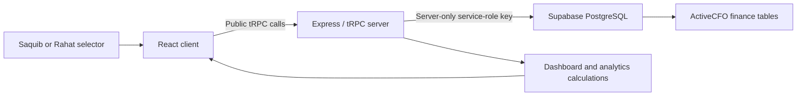

# ActiveCFO

ActiveCFO is a **manual, no-login household finance workspace** for exactly two selectable profiles: **Saquib** and **Rahat**. It is built for keeping monthly income, expenses, thresholds, investments, insurance, decision rules, and spending analysis in one place. It does not connect to banks, brokers, or market-price feeds, and it does not fabricate financial data.

> **Important:** The Saquib/Rahat selector is a product constraint, not an authorization mechanism. Treat this project as a private workspace and do not expose a public deployment without first adding a deliberate access-control design.

## What is included

| Area | Capability |
| --- | --- |
| Monthly workspace | Opening virtual balance, emergency target, and detailed monthly thresholds grouped as Needs, Wants, and Investment. |
| Ledger | CRUD for manual income and expense rows, including category, description, date, payment method, and notes. |
| Virtual balance | Computed as **opening virtual balance + monthly income − monthly expenses**. It is not a bank balance or forecast. |
| Investment records | Emergency Fund, Mutual Funds, ETFs, Crypto, and Custom Allocation CRUD. |
| Insurance | Separate Term, Health, and Corporate insurance record sections. |
| Decision tools | CRUD for guardrails, strategies, signals, and help-center articles. |
| Detailed Global Dashboard | Selected profile/month analytics: KPIs, budget consumption, savings reference, cash flow, allocation mix, variance, 12-month trend, daily accumulation, heatmap, hierarchy, and descriptions. |
| Exports | Browser-generated selected-month expense downloads in CSV and PDF formats. |

## Architecture



The browser never contacts Supabase directly. The server validates the fixed profile code and selected month, fetches saved records, and returns calculations required by the UI. Detailed analytics use the saved ledger bucket, category, and description fields; the current data model has no merchant field.

## Data and calculation boundaries

| Metric or visual | Source and behavior |
| --- | --- |
| Monthly totals and balance | Saved monthly settings and ledger rows for the selected profile and month. |
| Budget consumption and variance | Saved category thresholds compared with matching expense rows. Categories with spending but no threshold are marked unbudgeted. |
| Savings reference | Selected-month net cash flow compared with a displayed 20% reference only when income exists. It is a comparison, not financial advice. |
| 50/30/20 view | Saved Needs, Wants, and retained cash compared with displayed reference proportions. |
| Heatmap and daily charts | Calendar days with no saved expenses appear as zero; the app does not estimate transactions. |
| Trailing trend | Twelve calendar months of saved income and expense rows. Missing months are zero rather than predictions. |
| CSV/PDF export | The selected month’s returned expense rows, generated as a local browser download. |

## Local development

### Prerequisites

Use Node.js 22+ and pnpm. The project relies on a Supabase project already configured with the ActiveCFO schema.

```bash
pnpm install
pnpm dev
```

The available validation commands are:

```bash
pnpm test
pnpm check
pnpm build
```

### Required secret

For local server access, configure the server-only Supabase service-role secret through a secure local secret mechanism or an untracked `.env` file.

**Never** place this value in frontend code, `VITE_*` variables, GitHub Actions logs, issue comments, or a committed `.env` file. Managed deployments should use the platform’s secrets interface rather than repository files.

## Repository safety

The `.gitignore` file excludes environment files, common private key formats, database files, local secrets, build output, dependencies, and workspace artifacts. Before each push, run:

```bash
git status --short
git diff --cached -- . ':!node_modules'
pnpm test && pnpm check && pnpm build
```

Review any new configuration file carefully. Do not commit a populated `.env`, database dump, `SUPABASE_SERVICE_ROLE_KEY`, GitHub token, or personal finance export. See [SECURITY.md](./SECURITY.md) for the security policy.

## Project documentation

| File | Purpose |
| --- | --- |
| `DECISIONS.md` | Canonical record of product, data, security, and analytics decisions. |
| `FLOW.md` | Canonical user-visible workflows and data refresh paths. |
| `Feature.md` | Current feature inventory and calculation definitions. |
| `Architecture.md` | Runtime components, database model, and data path. |
| `constrains.md` | Product and technical constraints. |
| `rollback.md` | Checkpoint and recovery guidance. |

When a material feature changes access, data, calculations, exports, or user flow, update the relevant documentation in the same change set.
